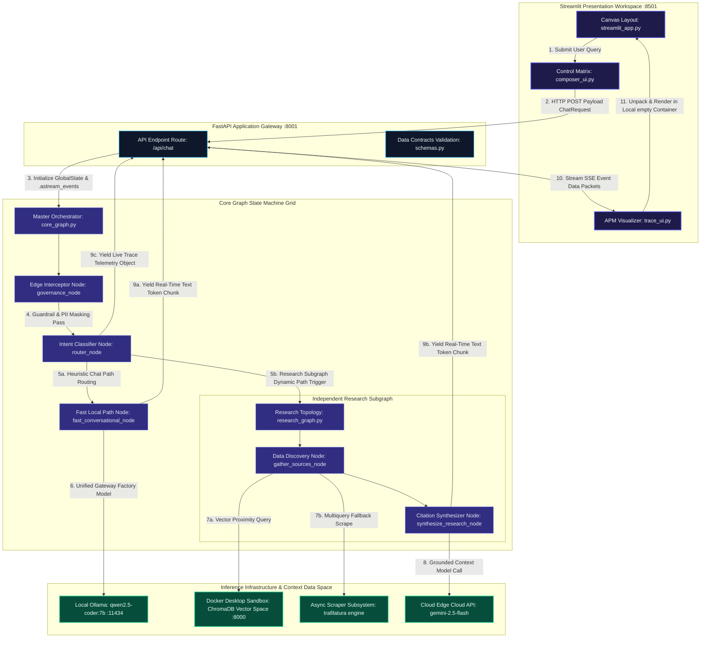
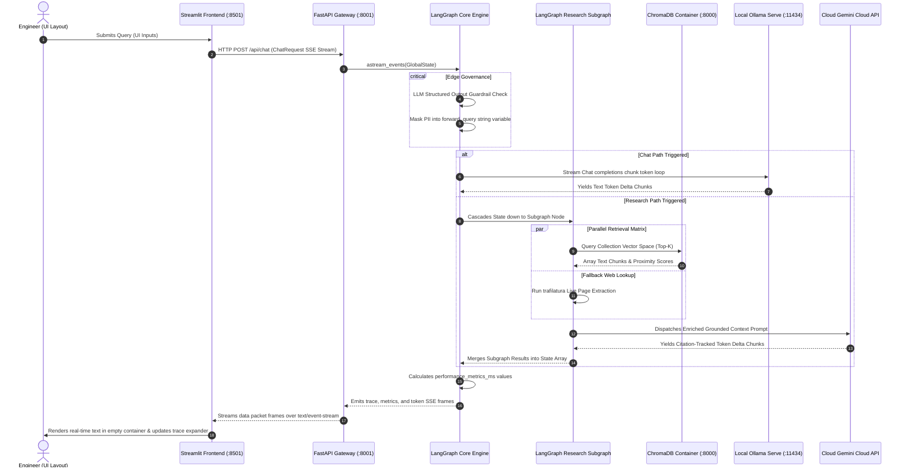
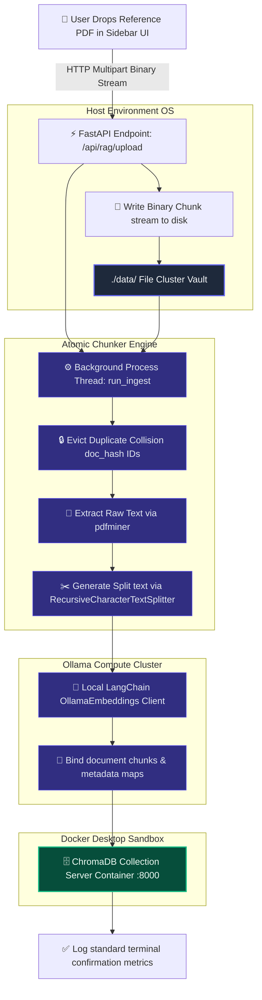

# Nexa Mind 🧠

Zero-Friction Technical Exploration, Grounded RAG, and Deep Analytics.

Nexa Mind is an enterprise-grade, high-density AI engineering assistant platform. It leverages a high-performance FastAPI gateway alongside a compiled, single-tiered native LangGraph Orchestration Network to route conversational prompts dynamically based on semantic complexity. By limiting front-end configurations to two macro choices (✨ Nexa Chat and 🔬 Deep Research), the system automatically coordinates edge security filtering, PII data masking, automated path-routing intent classifications, multi-query expansions, and async background vector data loading cleanly on the backend. All inferences are routed dynamically using a unified user-controlled layout model selector (🤖 Auto, LOCAL, CLOUD).

------------------------------

## 🏗️ Technical System Architecture
Nexa Mind is engineered as a decoupled, multi-tier runtime system. The interaction between the responsive Streamlit user interface canvas, the FastAPI communication routing layer, the compiled LangGraph execution topologies, and the underlying multi-provider model gateways is structured as a decoupled multi-tier architecture:



## 1. Unified Sequence Flow



## 2. Context Ingestion & Real-Time Background RAG Pipeline

When a technical reference manual or PDF is uploaded via the custom Streamlit sidebar expander console, it immediately triggers a non-blocking asynchronous multi-threaded ingestion workflow:



---

## 🚀 Key Architectural Pillars

* **Single State Data Fabric (`GlobalState`)** — Eliminates asynchronous serialization deadlocks, memory pointer address reference leaks, and sync drift by unifying user queries, routing classifications, token-scrubbing parameters, and append-only trace objects into a type-safe Pydantic source of truth using LangGraph's native `operator.add` list reducer.
* **Direct Graph Compilation Grid** — Replaces fragile external dynamic string loaders with hard-compiled explicit imports (`from app.graphs.research_graph import compiled_research_graph`). Subgraphs run natively inside parent nodes via direct invocations (`builder.add_node("execute_research_subgraph", compiled_research_graph)`).
* **Token-Masking & Local Guardrail Interceptors** — Inspects string payloads at the application boundary through pre-compiled high-performance regular expressions to stop code injection variations while automatically scrubbing PII elements (SSN, credit card strings, IPv4 masks) into secure `[..._REDACTED]` blocks.
* **Parallel Dual-Source Discovery Network** — Leverages a decoupled, isolated pipeline wrapper that concurrently pulls target text layers across multiple string transformations using local vector collections (ChromaDB) and off-thread public live web-scraping clusters.
* **Asynchronous Embedded Concurrency** — Accelerates indexing procedures by leveraging Python `asyncio.gather` on local hardware resources to hit Ollama's embedded endpoint thread matrices in parallel batches of 100 rows.

---

## 📂 Project Directory Structure

```text
nexusmind/
├── .env                       # Environment context configuration definitions
├── docker-compose.yaml        # Docker Desktop configuration file for ChromaDB services
├── pyproject.toml             # Python system build profiles managed via uv
├── run_ingest.py              # CLI utility hook to run directory-level data scans
├── run_nexusmind.sh           # Master local deployment boot environment shell script
├── tests/                     # Validation suite matrix layer
│   ├── eval_dataset.json      # RAG ground-truth assertion validation metrics
│   ├── run_eval.py            # Automated system scoring computation engine
│   └── test_backend.py        # PyTest integration boundary endpoints assertions
│
├── data/                      # Local PDF data cluster vault configuration mount
│   └── [REFERENCE_MANUALS].pdf
│
├── chroma-data/               # Persistent volume database mount registry
│   └── chroma.sqlite3
│
├── app/                       # FASTAPI LOGICAL ENGINE SERVICES CORE
│   ├── main.py                # System bootstrapper, CORS rules, and root logger
│   ├── settings.py            # Configuration bindings via Pydantic BaseSettings
│   ├── state_models.py        # Shared Pydantic LangGraph state definition models
│   ├── core_graph.py          # Master topology graph, intent routers, and guardrails
│   ├── llm_gateway.py         # Client adapters w/ automated cloud failover fallbacks
│   ├── rag_storage.py         # Text split processing, hashing, and parallel embeddings
│   │
│   ├── api/                   # CONSOLIDATED WEB APPS ENDPOINT REGISTRY
│   │   ├── routes.py          # Pathway handlers, background tasks hooks, uploads
│   │   └── schemas.py         # Request/Response validation models
│   │
│   ├── tools/                 # DATA DISCOVERY ISOLATED OPERATIONS Retrival Tools
│   │   ├── chroma_search.py   # Vector collection index query utility retriever
│   │   └── web_search.py      # Async live search scraper tool
│   │
│   └── graphs/                # INDEPENDENT COMPILATION AGENT SUBGRAPHS
│       └── research_graph.py  # Source parsing, node loops, deep query synthesis
│
└── frontend/                  # STREAMLIT UI DEVELOPMENT WORKSPACE
    ├── streamlit_app.py       # Main presentation layout center canvas loader
    └── ui/                    # MODULAR FRONTEND GRAPHICS SYSTEM INTERFACES
        ├── api_client.py      # Synchronized HTTP request broker layer
        ├── chat_ui.py         # Conversational historical bubble layout blocks
        ├── composer_ui.py     # Floating panel mode toggles and prompt input triggers
        ├── formatters.py      # Dynamic icon string labeling system transforms
        ├── sidebar_ui.py      # Control actions, settings trackers, upload bars
        ├── state.py           # Streamlit Session State initialization registries
        ├── styles.py          # Specialized high-density global layout CSS injections
        └── trace_ui.py        # Monospaced APM execution trace component

```

---

## 📈 Execution Profiles Routing Matrix

The orchestrator's router node maps pipeline execution pathways based on the layout configuration parameter context and input intent classification weights:

| Front-End Selected Mode | Intent Heuristic Trigger | Execution Target Pipeline | Active LLM Allocation Model | Dynamic System Prompt Persona |
| --- | --- | --- | --- | --- |
| **✨ Nexa Chat** | Plain structural conversational input queries ($<4$ terms) | `fast_conversational` node pass | Local Ollama instance via `qwen2.5-coder:7b` | `standard_utility` utility interface prompt |
| **✨ Nexa Chat** | High semantic density technical code queries | `fast_conversational` node pass | Local Ollama instance via `qwen2.5-coder:7b` | `standard_utility` utility interface prompt |
| **🔬 Deep Research** | Explicit UI Pill Button Option Selected | Native sub-network `execute_research_subgraph` node | Cloud Google GenAI `gemini-2.5-flash` *(Ollama Fallback)* | Academically anchored `socratic_professor` layout prompt |

---

## 🛠️ Installation & Getting Started

### Prerequisites

* **Python Runtime:** Python 3.12+ managed through **`uv`** package manager tool.
* **Local Inference Engine:** Ollama running locally with the requisite computational models active:
```bash
ollama pull qwen2.5-coder:7b
ollama pull nomic-embed-text

```


* **Virtualization Cluster Container Runtime:** Docker Desktop running locally on the host hardware machine.

### Deployment Operations Boot Sequence

1. **Configure Local Variables Configuration Environment** Generate an active configuration `.env` file directly inside the target project root folder path directory:
```env
# path: .env
APP_ENV=development
LOG_LEVEL=INFO
API_HOST=0.0.0.0
API_PORT=8001
CHROMA_HOST=localhost
CHROMA_PORT=8000
OLLAMA_BASE_URL=http://localhost:11434
OLLAMA_MODEL=qwen2.5-coder:7b
GEMINI_MODEL=gemini-2.5-flash
GEMINI_API_KEY=AIzaSyYourActualCloudGoogleAPIKeyHere
OFFLINE_PDF_DIR=./data

```


2. **Launch the Single-Harness Control Shell Runner Script** The system includes an enterprise shell deployment harness that verifies package locks via `uv`, runs validations against local Docker Desktop infrastructure, builds database mount registers, mounts the background model daemons, launches services, and binds graceful cleanup triggers:
```bash
# Add execution parameters permissions to the script file
chmod +x run_nexusmind.sh

# Fire the active runtime sequence orchestration script
./run_nexusmind.sh

```


3. **Verify Host Port Mapping Handshakes**
* **Streamlit UI Layout Platform Display Canvas:** `http://localhost:8501`
* **FastAPI Backend Core Engine REST APIs Swagger docs:** `http://localhost:8001/docs`
* **ChromaDB Docker Sandbox Endpoint:** `http://localhost:8000`


---

## ⚙️ Real-Time Telemetry Performance Monitoring

The Streamlit web container renders custom execution trace nodes instantly. This format maps directly to your Pydantic channel arrays, offering clear visibility into system latency:

```text
⚙️ TRACE | RESEARCH | 3142ms
📡 PLATFORM ENGINE  ::  [ROUTE: RESEARCH]
🐳 INFRASTRUCTURE   ::  [VIRTUALIZATION: Docker Desktop Engine Runtime]
🗄️ VECTOR STORE     ::  [ENGINE: ChromaDB Container Cluster]
🧠 LOGICAL COMPUTE  ::  [TIER: HIGH (Cloud Scale)]

⛓️ PIPELINE CHRONOLOGICAL FLOW DIAGRAM
 ├── 🟢 [1] Security Check Engine ──> [Input governance verification clear.]
 ├── 🟢 [2] Intent Router (HIGH) ──> [Allocated Target Pipeline Matrix: [RESEARCH]]
 ├── 🟢 [3] Research Core ──> [Invoking atomic search tools across variations.]
 ├── 🟢 [4] ChromaDB Engine ──> [Grounding match confirmed across vectors (Dist: 0.28)]
 ├── 🟢 [5] Web Scraper ──> [Executing live web lookup fallback transformations.]
 ├── 🟢 [6] Synthesis Engine ──> [Generating response via [gemini-2.5-flash].]
 └── 🏁 Research Core ──> [Deep analysis complete.] (3142ms)

📚 DATA RECOVERY SUBSYSTEM
 └── [SOURCES LOADED: 4] [RETRIEVAL COMPUTE: 842ms]

```

---

## 👥 Maintenance Frame

* **Workspace Owner:** Ranapratap Majee — AI Framework Architecture Specialist.
* **License:** Managed and distributed under standard `MIT License` code parameters.
