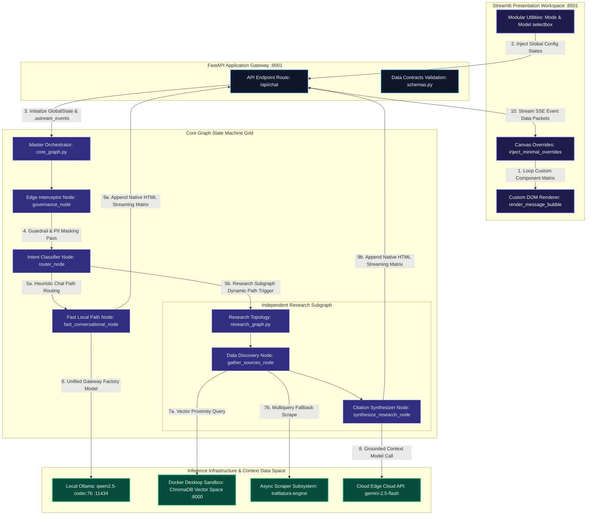
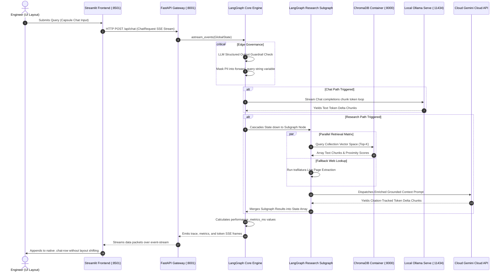
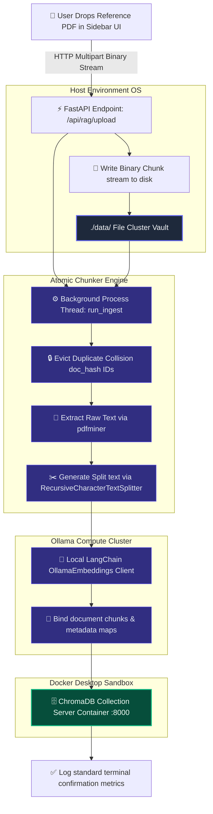

# NexusMind 🧠

Zero-Friction Technical Exploration, Grounded RAG, and Deep Analytics.

NexusMind is an enterprise-grade, high-density AI engineering assistant platform. It leverages a high-performance FastAPI gateway alongside a compiled, single-tiered native LangGraph Orchestration Network to route conversational prompts dynamically based on semantic complexity. By leveraging a centralized, custom-engineered user interface mimicking premium modern workspaces (like Gemini), the interface strips out bloat and wraps messaging rows directly in zero-overhead HTML flex arrays. System controls are compressed into dual top-of-chatbox micro utilities managing the active conversation pipeline mode (🧠 Auto Orchestrate, ✨ Nexa Chat, 🔬 Deep Research) and the compute infrastructure runtime selector (🤖 Auto Model, LOCAL, CLOUD) natively anchored inside a single compact boundary footprint.

------------------------------

## 🏗️ Technical System Architecture
NexusMind is engineered as a decoupled, multi-tier runtime system. The interaction between the responsive, avatar-free Streamlit custom presentation canvas, the FastAPI communication routing layer, the compiled LangGraph execution topologies, and the underlying multi-provider model gateways is structured as a decoupled multi-tier architecture:



## 1. Unified Sequence Flow



## 2. Context Ingestion & Real-Time Background RAG Pipeline

When a technical reference manual or PDF is uploaded via the custom Streamlit sidebar expander console, it immediately triggers a non-blocking asynchronous multi-threaded ingestion workflow:



---

## 🚀 Key Architectural Pillars

* **Avatar-Free Clean HTML Messaging DOM** — Circumvents the structural alignment constraints, ghost margins, and wide layout component stretching seen in typical Streamlit deployments by shifting rendering tasks into a lightweight component wrapper (`render_message_bubble`) using raw HTML flex vectors (`.chat-row`).
* **Centralized Capsule Input Workspace** — Configures your application's focus area into a centered, $720\text{px}$ track capsule. Features subtle border shadows, text wrapping, and an integrated Inter typography stack to align perfectly with high-end, responsive system layout principles.
* **Modular Single-Line Utility Track** — Isolates configuration dropdown models cleanly inside `st.bottom`. Uses a side-by-side flex block configuration that sits tightly aligned above the prompt capsule, with individual selectbox components handling their own layout sizing rules.
* **Direct Graph Compilation Grid** — Replaces fragile external dynamic string loaders with hard-compiled explicit imports (`from app.graphs.research_graph import compiled_research_graph`). Subgraphs run natively inside parent nodes via direct activations.
* **Token-Masking & Local Guardrail Interceptors** — Inspects string payloads at the application boundary through pre-compiled high-performance regular expressions to stop code injection variations while automatically scrubbing PII elements (SSN, credit card strings, IPv4 masks) into secure `[..._REDACTED]` blocks.

---

## 📂 Project Directory Structure

```text
nexusmind/
├── .env                       # Environment context configuration definitions
├── docker-compose.yaml        # Docker Desktop configuration file for ChromaDB services
├── pyproject.toml             # Python system build profiles managed via uv
├── run_ingest.py              # CLI utility hook to run directory-level data scans
├── run_nexusmind.sh           # Master local deployment boot environment shell script
├── tests/                     # Validation suite matrix layer
│   ├── eval_dataset.json      # RAG ground-truth assertion validation metrics
│   ├── run_eval.py            # Automated system scoring computation engine
│   └── test_backend.py        # PyTest integration boundary endpoints assertions
│
├── data/                      # Local PDF data cluster vault configuration mount
│   └── [REFERENCE_MANUALS].pdf
│
├── chroma-data/               # Persistent volume database mount registry
│   └── chroma.sqlite3
│
├── app/                       # FASTAPI LOGICAL ENGINE SERVICES CORE
│   ├── main.py                # System bootstrapper, CORS rules, and root logger
│   ├── settings.py            # Configuration bindings via Pydantic BaseSettings
│   ├── state_models.py        # Shared Pydantic LangGraph state definition models
│   ├── core_graph.py          # Master topology graph, intent routers, and guardrails
│   ├── llm_gateway.py         # Client adapters w/ automated cloud failover fallbacks
│   ├── rag_storage.py         # Text split processing, hashing, and parallel embeddings
│   │
│   ├── api/                   # CONSOLIDATED WEB APPS ENDPOINT REGISTRY
│   │   ├── routes.py          # Pathway handlers, background tasks hooks, uploads
│   │   └── schemas.py         # Request/Response validation models
│   │
│   ├── tools/                 # DATA DISCOVERY ISOLATED OPERATIONS Retrieval Tools
│   │   ├── chroma_search.py   # Vector collection index query utility retriever
│   │   └── web_search.py      # Async live search scraper tool
│   │
│   └── graphs/                # INDEPENDENT COMPILATION AGENT SUBGRAPHS
│       └── research_graph.py  # Source parsing, node loops, deep query synthesis
│
└── frontend/                  # STREAMLIT UI DEVELOPMENT WORKSPACE
    └── streamlit_app.py       # Main presentation interface canvas utilizing the Inter sans font-stack

```

---

## 📈 Execution Profiles Routing Matrix

The orchestrator's router node maps pipeline execution pathways based on the layout configuration parameter context and input intent classification weights:

| Selected Chat Mode | Component Selection Target | Execution Target Pipeline | Active LLM Allocation Model | Dynamic System Prompt Persona |
| --- | --- | --- | --- | --- |
| **🧠 Auto Orchestrate** | Modular `st.selectbox` left-rail utility | Automated router path classification pass | Evaluated dynamically based on query profile | Unified, semantic context system controller prompt |
| **✨ Nexa Chat** | Modular `st.selectbox` left-rail utility | `fast_conversational` node pass | Local Ollama instance via `qwen2.5-coder:7b` | `standard_utility` utility interface prompt |
| **🔬 Deep Research** | Modular `st.selectbox` left-rail utility | Native sub-network `execute_research_subgraph` node | Cloud Google GenAI `gemini-2.5-flash` *(Ollama Fallback)* | Academically anchored `socratic_professor` layout prompt |

---

## 🛠️ Installation & Getting Started

### Prerequisites

* **Python Runtime:** Python 3.12+ managed through **`uv`** package manager tool.
* **Local Inference Engine:** Ollama running locally with the requisite computational models active:

```bash
ollama pull qwen2.5-coder:7b
ollama pull nomic-embed-text

```

* **Virtualization Cluster Container Runtime:** Docker Desktop running locally on the host hardware machine.

### Deployment Operations Boot Sequence

1. **Configure Local Variables Configuration Environment** Generate an active configuration `.env` file directly inside the target project root folder path directory:

```env
# path: .env
APP_ENV=development
LOG_LEVEL=INFO
API_HOST=0.0.0.0
API_PORT=8001
CHROMA_HOST=localhost
CHROMA_PORT=8000
OLLAMA_BASE_URL=http://localhost:11434
OLLAMA_MODEL=qwen2.5-coder:7b
GEMINI_MODEL=gemini-2.5-flash
GEMINI_API_KEY=AIzaSyYourActualCloudGoogleAPIKeyHere
OFFLINE_PDF_DIR=./data

```

2. **Launch the Single-Harness Control Shell Runner Script** The system includes an enterprise shell deployment harness that verifies package locks via `uv`, runs validations against local Docker Desktop infrastructure, builds database mount registers, mounts the background model daemons, launches services, and binds graceful cleanup triggers:

```bash
# Add execution parameters permissions to the script file
chmod +x run_nexusmind.sh

# Fire the active runtime sequence orchestration shell script
./run_nexusmind.sh

```

3. **Verify Host Port Mapping Handshakes**

* **Streamlit UI Layout Platform Display Canvas:** `http://localhost:8501`
* **FastAPI Backend Core Engine REST APIs Swagger docs:** `http://localhost:8001/docs`
* **ChromaDB Docker Sandbox Endpoint:** `http://localhost:8000`

---

## 👥 Maintenance Frame

* **Workspace Owner:** Ranapratap Majee — AI Framework Architecture Specialist.
* **License:** Managed and distributed under standard `MIT License` code parameters.
